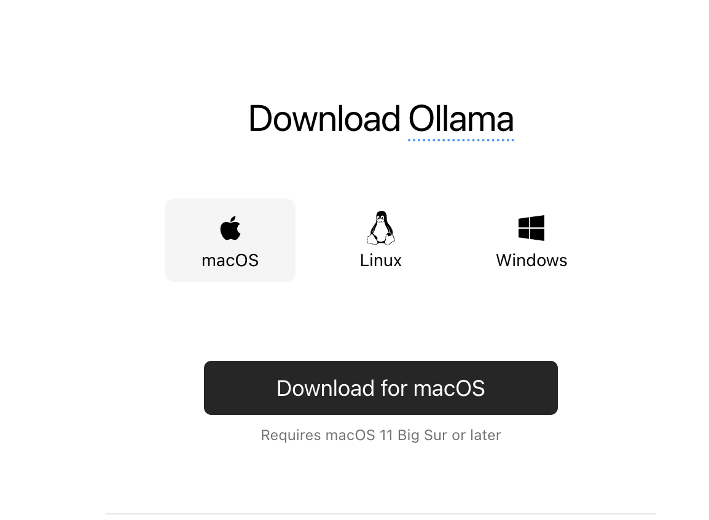
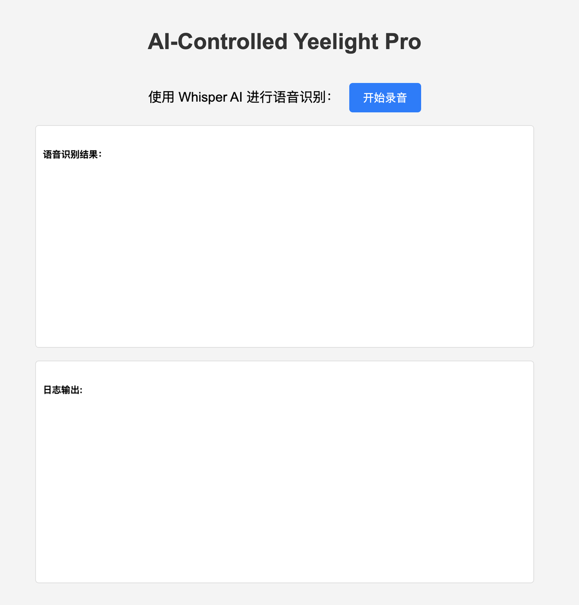
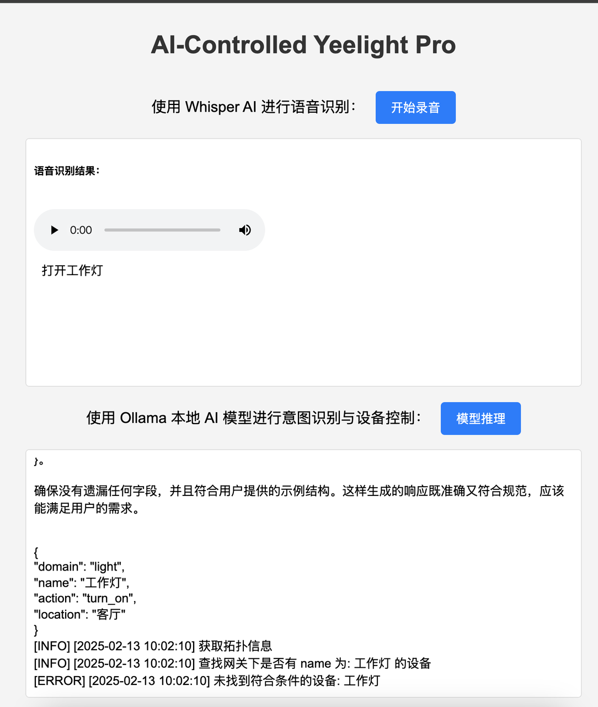
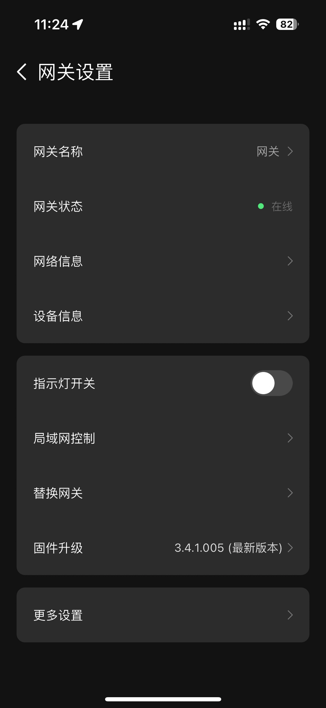
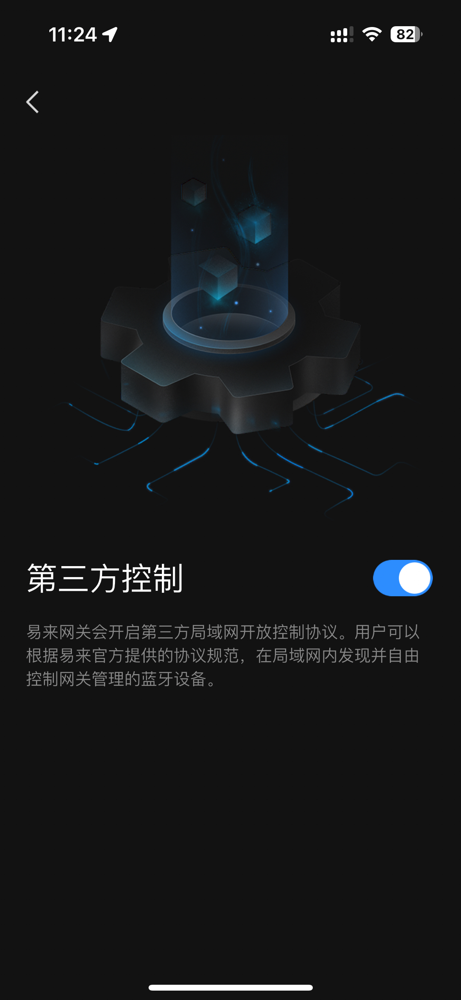

# Macbook 本地搭建 Deepseek-R1 控制 Yeelight Pro（语音版）

## 1. 安装 Ollama

Ollama 是一个支持在本地运行和定制大型语言模型的工具。


- **下载并安装**：访问 [Ollama 官网](https://ollama.com/download)，下载适用于 macOS 的安装包。下载完成后，双击安装包并按照提示完成安装。
- **验证安装**：打开终端，输入以下命令以验证安装是否成功：

  ```bash
  ollama --version
  ```

  如果显示版本信息，则表示安装成功。

### 1.1 加载 Deepseek 模型

在终端中，使用以下命令拉取并运行所需的模型（以 `deepseek-r1:1.5b` 为例）：

```bash
ollama pull deepseek-r1:1.5b
ollama run deepseek-r1:1.5b
```

具体其他模型的命令参考 [Deepseek 官方库](https://ollama.com/library/deepseek-r1)（8G 内存建议部署 `1.5B` 模型）。

这将启动模型服务，默认监听在 `http://localhost:11434`。

### 1.2 加载 Whisper 模型

Whisper 是由 OpenAI 开发的一个自动语音识别（ASR）模型，它能够将语音（音频）转换为文本。

可以在项目文件 `config.py` 中指定模型大小，默认为 `base` 模型，初次运行项目时，会下载模型并加载，需要等待几分钟时间。

## 2. 其他先决条件

在开始之前，请确保您的 MacBook 上安装了以下软件：

- Homebrew（macOS 的包管理器）
- Python 3（包括 pip）

### 2.1 安装 Homebrew

打开终端并运行以下命令以安装 Homebrew：

```bash
/bin/bash -c "$(curl -fsSL https://raw.githubusercontent.com/Homebrew/install/HEAD/install.sh)"
```

安装完成后，您可以通过运行以下命令来验证安装：

```bash
brew --version
```

### 2.2 安装 Python 3

使用 Homebrew 安装 Python 3：

```bash
brew install python@3.9
```

安装完成后，您可以通过运行以下命令来验证安装：

```bash
 ## Apple Silicon 架构 
/opt/homebrew/bin/python3.9 --version
/opt/homebrew/opt/python@3.9/bin/pip3.9 --version

## Intel 架构
/usr/local/opt/python@3.9 --version
/usr/local/opt/python@3.9/bin/pip3.9 --version
```

### 2.3 安装 ffmpeg

FFmpeg 是一个开源的多媒体框架，用于录制、转换、流式传输音频、视频以及其他多媒体文件和流。执行以下命令来安装 ffmpeg：

```bash
brew install ffmpeg
```

### 2.4 安装 piper

将输入的文本转换成语音，并通过系统内置的语音引擎播放，语音回复对话结果。执行以下命令来安装 piper

```bash
pip install piper-tts --no-deps piper-phonemize-cross onnxruntime numpy
```

## 3. 下载项目

使用 Git 克隆项目到本地：

```bash
cd ~/ai_home_control_space
git clone https://github.com/Yeelight/ai_control_yeelight_pro.git
cd ai_home_control
```

或者直接下载文件压缩包：

```bash
curl -L -C - -o ai_home_control.zip https://github.com/Yeelight/ai_control_yeelight_pro/archive/refs/tags/v0.0.1.zip

```

## 4. 设置 Python 环境

### 4.1 创建虚拟环境

在项目目录中创建一个 Python 虚拟环境：

```bash
## Apple Silicon 架构 
/opt/homebrew/bin/python3.9 -m venv venv

## Intel 架构
/usr/local/opt/python@3.9  -m venv venv
```

### 4.2 激活虚拟环境

```bash
source venv/bin/activate
```

### 4.3 安装 Python 依赖

确保您在虚拟环境中，然后安装项目所需的 Python 依赖项：

```bash
## Apple Silicon 架构 
/opt/homebrew/opt/python@3.9/bin/pip3.9 install -r requirements.txt -i https://mirrors.tuna.tsinghua.edu.cn/pypi/web/simple

## Intel 架构
/usr/local/opt/python@3.9/bin/pip3.9 install -r requirements.txt -i https://mirrors.tuna.tsinghua.edu.cn/pypi/web/simple
```

## 5. 启动服务

确保您仍在虚拟环境中，然后运行 Flask 应用程序：

```bash
## Apple Silicon 架构 
/opt/homebrew/bin/python3.9 app.py

## Intel 架构
/opt/homebrew/bin/python3.9 app.py
```

## 6. 访问应用程序

打开浏览器并访问以下 URL：

```bash
http://localhost:8888
```



## 7. 打开本地网关局域网控制

